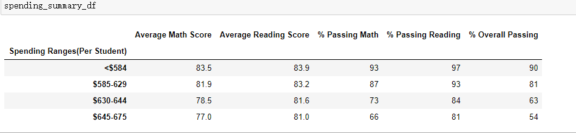

# School_District_Analysis
## Overview of the school district analysis
We have complete the list of deliverables for the analysis of the school district:
A high-level snapshot of the district's key metrics, presented in a table format
An overview of the key metrics for each school, presented in a table format
Tables presenting each of the following metrics:
Top 5 and bottom 5 performing schools, based on the overall passing rate
The average math score received by students in each grade level at each school
The average reading score received by students in each grade level at each school
School performance based on the budget per student
School performance based on the school size 
School performance based on the type of school

However, the school board has notified Maria and her supervisor that the students_complete.csv file shows evidence of academic dishonesty; specifically, reading and math grades for Thomas High School ninth graders appear to have been altered. We would like to replace the math and reading scores for Thomas High School with NaNs while keeping the rest of the data intact, and explore how these changes affected the overall analysis once we've replaced the math and reading scores.

## Results
1)How is the district summary affected?
The results for before and after the replacement are shown below:
 (original)
 (replaced)

We could see that the total schools and total budget stay unchanged. However, the "Total student" is slightly reduced as well as the average scores and the passing percentages for both math and reading as we replaced the scores of ninth-graders from Thomas High school with NAN and we excluded them from the new student count. 

2)How is the school summary affected?
The results for before and after the replacement are shown below:
 (original)
 (replaced)

We could see that everything stay the same except for Thomas High School. The average math and reading scores have been slightly lowered as well as the passing percentage for both math and reading.

3)How does replacing the ninth graders’ math and reading scores affect Thomas High School’s performance relative to the other schools?
The results for before and after the replacement are shown below:
 (original)
 (replaced)

We could see that although the average scores and passing percentages have been reduced for Thomas High School after the replacement, Thomas High School still ranks the second in the top school list. Therefore, the replacement does not affact Thomas High School's performance relative to the other schools.

4)How does replacing the ninth-grade scores affect the following:
-Math and reading scores by grade
The results for before and after the replacement are shown below:

  (original)

  (replaced)

We could see that only things that changed are the math and reading scores for ninth-graders from Thomas High School, as the are replaced as NAN.

-Scores by school spending
The results for before and after the replacement are shown below:
 (original)
 (replaced)

We could see that there is no change on the scores by school spending as the effects of the replacement seem insignificant when looking at the whole picture. 

-Scores by school size
The results for before and after the replacement are shown below:
 (original)
 (replaced)

We could see that there is no change on the scores by school size as the effects of the replacement seem insignificant when looking at the whole picture. 

-Scores by school type
The results for before and after the replacement are shown below:
 (original)
 (replaced)

We could see that there is no change on the scores by school type as the effects of the replacement seem insignificant when looking at the whole picture.

## Summary
The four major changes are as the following:
1) The average math and reading scores for students in Thomas High School have been lowered after the replacement.
2) The passing percentages of math, reading and overall have been lowered as well after the replacement.
3) The average math and reading scores for the district summary have been reduced.
4) The passing percentages of math, reading and overall for the district summary have been lowered.
